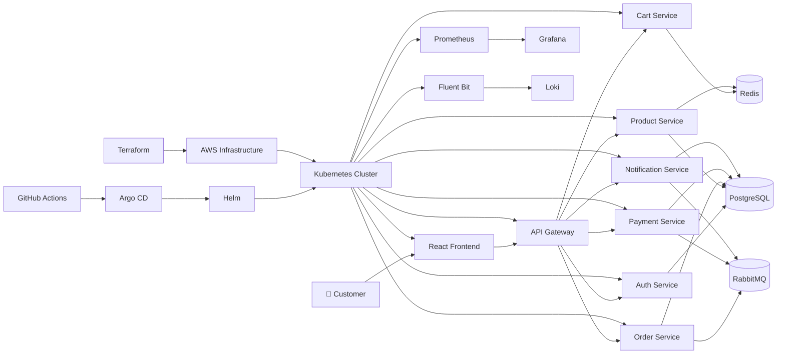

# 🚀 Production-Grade E-Commerce Microservices Platform on Kubernetes


---

# 🛒 Production-Grade E-Commerce Microservices Platform

A **Production-Grade Cloud-Native E-Commerce Platform** built using **Java 21**, **Spring Boot 3**, **React 19**, **Docker**, **Kubernetes**, **Helm**, **Terraform**, **AWS**, **GitHub Actions**, and **Argo CD**.

This project demonstrates how modern enterprise applications are designed, developed, deployed, monitored, secured, and operated in production environments.

Unlike traditional CRUD applications, this project follows enterprise software engineering practices including:

* Microservices Architecture
* Event-Driven Communication
* Database-per-Service Pattern
* GitOps Deployment
* Infrastructure as Code (IaC)
* CI/CD Automation
* Kubernetes Orchestration
* Cloud-Native Security
* Observability
* Production Hardening
* High Availability
* Disaster Recovery

The platform is designed to closely resemble the architecture used by large-scale technology companies and serves as a comprehensive reference for **Software Engineering**, **Backend Development**, **Cloud Engineering**, **Platform Engineering**, **DevOps**, and **Site Reliability Engineering (SRE)**.

---

# ✨ Key Features

| Feature                       | Description                                    |
| ----------------------------- | ---------------------------------------------- |
| 🏗 Microservices Architecture | Independently deployable Spring Boot services  |
| 🚪 API Gateway                | Centralized routing using Spring Cloud Gateway |
| 🔐 Authentication             | JWT Authentication with Refresh Tokens         |
| 🛍 Product Catalog            | Category, Inventory & Product Management       |
| 🛒 Shopping Cart              | Redis-backed Cart Service                      |
| 📦 Order Management           | Complete Order Lifecycle                       |
| 💳 Payment Processing         | Event-driven Payment Service                   |
| 📧 Notification Service       | Email/Event Notifications                      |
| 📨 RabbitMQ                   | Asynchronous Event Communication               |
| 🗄 PostgreSQL                 | Database-per-Service Pattern                   |
| ⚡ Redis                       | High-performance Caching                       |
| 🐳 Docker                     | Multi-stage Containerization                   |
| ☸ Kubernetes                  | Production-grade Orchestration                 |
| 📦 Helm                       | Kubernetes Package Management                  |
| 🔄 Argo CD                    | GitOps Continuous Deployment                   |
| ⚙ Terraform                   | AWS Infrastructure Provisioning                |
| 🚀 GitHub Actions             | Enterprise CI/CD Pipelines                     |
| 📈 Prometheus                 | Metrics Collection                             |
| 📊 Grafana                    | Real-Time Dashboards                           |
| 📜 Loki                       | Centralized Log Aggregation                    |
| 🛡 Trivy + Checkov + Gitleaks | Enterprise Security Scanning                   |
| 📋 OpenAPI                    | API Documentation                              |
| 🧪 Testcontainers             | Integration Testing                            |
| 📦 Flyway                     | Database Versioning                            |
| 📚 ADR Documentation          | Architecture Decision Records                  |
| 📈 Production Ready           | Enterprise-grade Deployment                    |

---

# 🏛 Enterprise Architecture



---

# 🏗 High-Level Architecture

```
                    Internet
                        │
                        ▼
              ┌────────────────────┐
              │ React Frontend     │
              │ (React 19 + Vite)  │
              └─────────┬──────────┘
                        │
                        ▼
              ┌────────────────────┐
              │ API Gateway        │
              │ Spring Cloud       │
              └─────────┬──────────┘
                        │
 ┌───────────┬──────────┼──────────┬───────────┬───────────┬───────────┐
 ▼           ▼          ▼          ▼           ▼           ▼
Auth      Product      Cart      Order      Payment   Notification
Service   Service     Service    Service    Service      Service

 │            │          │          │            │           │
 ▼            ▼          ▼          ▼            ▼           ▼

 PostgreSQL  PostgreSQL Redis   PostgreSQL PostgreSQL PostgreSQL

                 │
                 ▼

             RabbitMQ
         (Event Driven Messaging)

                 │
                 ▼

          Kubernetes Cluster
                 │
                 ▼

      Prometheus • Grafana • Loki

                 │
                 ▼

 Helm → Argo CD → AWS (Terraform)
```

---

# 🎯 Project Objectives

The primary goal of this project is to demonstrate how a real-world enterprise e-commerce platform can be designed using modern cloud-native technologies.

The platform emphasizes:

* Clean Architecture
* SOLID Principles
* Domain-Driven Design Concepts
* Scalable Microservices
* Event-Driven Architecture
* Containerization
* Infrastructure as Code
* GitOps
* CI/CD Automation
* Security Best Practices
* Observability
* High Availability
* Production Hardening
* Cloud Deployment on AWS

This repository is intended for learning, portfolio building, interview preparation, and as a reference implementation for enterprise software architecture.
# 🛠️ Technology Stack

## Backend

| Technology                  | Version | Purpose                        |
| --------------------------- | ------- | ------------------------------ |
| Java                        | 21      | Programming Language           |
| Spring Boot                 | 3.3.x   | Microservices Framework        |
| Spring Security             | Latest  | Authentication & Authorization |
| Spring Data JPA             | Latest  | ORM                            |
| Spring Cloud Gateway        | Latest  | API Gateway                    |
| Spring Cloud OpenFeign      | Latest  | Service Communication          |
| Spring Validation           | Latest  | Request Validation             |
| Spring Boot Actuator        | Latest  | Health Monitoring              |
| Spring Retry + Resilience4j | Latest  | Circuit Breaker & Retry        |
| Flyway                      | Latest  | Database Migration             |
| MapStruct                   | Latest  | DTO Mapping                    |
| Lombok                      | Latest  | Boilerplate Reduction          |
| JWT                         | Latest  | Stateless Authentication       |

---

## Frontend

| Technology      | Version | Purpose                 |
| --------------- | ------- | ----------------------- |
| React           | 19      | User Interface          |
| TypeScript      | Latest  | Type Safety             |
| Vite            | Latest  | Build Tool              |
| Redux Toolkit   | Latest  | Global State Management |
| React Router    | v6      | Routing                 |
| Material UI     | Latest  | UI Components           |
| React Hook Form | Latest  | Forms                   |
| Axios           | Latest  | HTTP Client             |
| TanStack Query  | Latest  | Server State            |
| Chart.js        | Latest  | Dashboards              |

---

## Database & Caching

| Technology    | Purpose               |
| ------------- | --------------------- |
| PostgreSQL 16 | Primary Database      |
| Redis 7       | Cache & Session Store |
| RabbitMQ      | Event Messaging       |

---

## DevOps & Cloud

| Technology      | Purpose                       |
| --------------- | ----------------------------- |
| Docker          | Containerization              |
| Docker Compose  | Local Development             |
| Kubernetes      | Container Orchestration       |
| Helm            | Kubernetes Package Management |
| Argo CD         | GitOps Deployment             |
| Terraform       | Infrastructure as Code        |
| AWS EKS         | Kubernetes Cluster            |
| AWS RDS         | PostgreSQL Database           |
| AWS ElastiCache | Redis                         |
| AWS Route53     | DNS                           |
| AWS IAM         | Security                      |
| AWS VPC         | Networking                    |

---

## Monitoring & Logging

| Tool         | Purpose            |
| ------------ | ------------------ |
| Prometheus   | Metrics Collection |
| Grafana      | Visualization      |
| Loki         | Log Aggregation    |
| Fluent Bit   | Log Shipping       |
| Alertmanager | Alert Routing      |

---

## Security

| Tool             | Purpose               |
| ---------------- | --------------------- |
| Trivy            | Container Scanning    |
| Gitleaks         | Secret Detection      |
| Checkov          | IaC Security          |
| Kubernetes RBAC  | Access Control        |
| Network Policies | Zero Trust Networking |
| JWT              | Authentication        |
| OWASP Top 10     | Secure Coding         |

---

## Testing

| Tool           | Purpose             |
| -------------- | ------------------- |
| JUnit 5        | Unit Testing        |
| Mockito        | Mocking             |
| Testcontainers | Integration Testing |
| Postman        | API Testing         |
| Newman         | API Automation      |
| K6             | Load Testing        |
| SonarQube      | Code Quality        |
| OWASP ZAP      | Security Testing    |

---

# 📂 Project Structure

```text
Production-Grade-E-Commerce-Microservices-Platform-on-Kubernetes/
│
├── .github/                    # GitHub Actions CI/CD workflows
├── argocd/                     # GitOps deployment manifests
├── databases/                  # PostgreSQL, Redis & DB migrations
├── docker/                     # Docker Compose configurations
├── docs/                       # Architecture, ADRs & planning docs
├── environments/               # Dev, Staging & Production configs
├── helm/                       # Helm charts
├── kubernetes/                 # Kubernetes manifests
├── logging/                    # Fluent Bit configuration
├── messaging/                  # RabbitMQ configuration
├── monitoring/                 # Prometheus, Grafana, Loki
├── operations/                 # Runbooks & production hardening
├── scripts/                    # Automation scripts
├── security/                   # RBAC, Trivy, Checkov, Gitleaks
├── services/                   # All application services
│   ├── frontend/
│   ├── api-gateway/
│   ├── auth-service/
│   ├── product-service/
│   ├── cart-service/
│   ├── order-service/
│   ├── payment-service/
│   └── notification-service/
├── terraform/                  # AWS Infrastructure
├── tests/                      # Integration, Load & Security Tests
│
├── README.md
├── LICENSE
├── CHANGELOG.md
└── Makefile
```

---

# 🏢 Microservices Overview

The platform follows the **Database-per-Service** architectural pattern where every microservice owns its own database and can be independently developed, deployed, and scaled.

---

## 🌐 API Gateway

**Technology:** Spring Cloud Gateway

Responsibilities:

* Centralized Routing
* JWT Token Forwarding
* Rate Limiting
* Request Filtering
* CORS
* Circuit Breaker
* Load Balancing

---

## 🔐 Authentication Service

Responsibilities:

* User Registration
* User Login
* JWT Authentication
* Refresh Tokens
* Password Encryption
* Role-Based Access Control (RBAC)
* User Profile Management

Database:

* PostgreSQL

Cache:

* Redis

---

## 🛍️ Product Service

Responsibilities:

* Product Catalog
* Category Management
* Inventory Management
* Product Search
* Redis Caching

Database:

* PostgreSQL

Messaging:

* RabbitMQ Events

---

## 🛒 Cart Service

Responsibilities:

* Shopping Cart
* Add to Cart
* Remove Item
* Update Quantity
* Cart Expiration
* Cart Synchronization

Storage:

* Redis

---

## 📦 Order Service

Responsibilities:

* Order Creation
* Order Status Tracking
* Checkout Process
* Order History
* Event Publishing

Database:

* PostgreSQL

Messaging:

* RabbitMQ

---

## 💳 Payment Service

Responsibilities:

* Payment Processing
* Payment Verification
* Transaction History
* Payment Events
* Refund Support

Database:

* PostgreSQL

Messaging:

* RabbitMQ

---

## 📧 Notification Service

Responsibilities:

* Email Notifications
* Order Confirmation
* Payment Confirmation
* Shipping Updates
* Event Consumers

Database:

* PostgreSQL

Messaging:

* RabbitMQ

---

## 💻 React Frontend

Responsibilities:

* Customer Portal
* Product Browsing
* Shopping Cart
* Checkout
* User Dashboard
* Admin Dashboard

---

# 🗄️ Database Architecture

The application follows the **Database-per-Service** pattern.

```text
Auth Service
      │
      ▼
Auth Database

Product Service
      │
      ▼
Product Database

Order Service
      │
      ▼
Order Database

Payment Service
      │
      ▼
Payment Database

Notification Service
      │
      ▼
Notification Database

Cart Service
      │
      ▼
Redis
```

Each service owns its schema, ensuring:

* Loose Coupling
* Independent Scaling
* Independent Deployments
* Fault Isolation
* High Availability

---

# 📨 Event-Driven Architecture

RabbitMQ enables asynchronous communication between services.

### Published Events

* ProductCreated
* ProductUpdated
* InventoryUpdated
* OrderCreated
* OrderConfirmed
* PaymentInitiated
* PaymentCompleted
* PaymentFailed
* NotificationRequested

### Benefits

* Loose Coupling
* Better Scalability
* Eventual Consistency
* Improved Reliability
* Fault Tolerance

---

# 🔄 Request Flow

```text
Customer

↓

React Frontend

↓

API Gateway

↓

Authentication

↓

Business Services

↓

Database

↓

RabbitMQ Events

↓

Notification Service

↓

Customer
```

---

# 📈 Scalability Features

The platform is designed to scale horizontally.

Implemented strategies include:

* Stateless Microservices
* Horizontal Pod Autoscaler (HPA)
* Kubernetes Deployments
* Redis Caching
* RabbitMQ Queues
* Database Connection Pooling
* Circuit Breakers
* Retry Mechanisms
* Rolling Updates
* Zero Downtime Deployment

This architecture supports production workloads while maintaining high availability and resilience.
# 🐳 Docker Containerization

Every application within the platform is containerized using **Docker 27+** following enterprise-grade best practices.

## Docker Features

* Multi-stage Docker builds
* Non-root containers
* Lightweight runtime images
* Optimized layer caching
* Environment variable configuration
* Health checks
* Production-ready ENTRYPOINT
* Dedicated `.dockerignore` files
* Minimal image size

---

## Dockerized Services

| Service              | Runtime        |
| -------------------- | -------------- |
| React Frontend       | Nginx          |
| API Gateway          | Spring Boot    |
| Auth Service         | Spring Boot    |
| Product Service      | Spring Boot    |
| Cart Service         | Spring Boot    |
| Order Service        | Spring Boot    |
| Payment Service      | Spring Boot    |
| Notification Service | Spring Boot    |
| PostgreSQL           | Official Image |
| Redis                | Official Image |
| RabbitMQ             | Official Image |

---

## Docker Networking

The platform uses isolated Docker bridge networks.

```text
Frontend Network
       │
       ▼
API Gateway
       │
       ▼
Backend Network
       │
 ┌─────┴───────────────────────┐
 │                             │
Microservices              RabbitMQ
 │                             │
 └──────────────┬──────────────┘
                ▼
Infrastructure Network
      │
 ┌────┴─────────────┐
 │                  │
PostgreSQL       Redis
```

---

## Persistent Volumes

Docker volumes ensure persistent storage for stateful services.

| Volume           | Purpose             |
| ---------------- | ------------------- |
| postgres-data    | PostgreSQL Database |
| redis-data       | Redis Cache         |
| rabbitmq-data    | RabbitMQ Messages   |
| application-logs | Container Logs      |

---

# ☸ Kubernetes Deployment

The entire application is orchestrated using **Kubernetes**, providing high availability, self-healing, automatic scaling, and rolling deployments.

---

## Kubernetes Architecture

```text
Internet
      │
      ▼
Ingress Controller
      │
      ▼
API Gateway Service
      │
      ▼
┌──────────────────────────────────────┐
│ Kubernetes Cluster                   │
│                                      │
│ Auth Service                         │
│ Product Service                      │
│ Cart Service                         │
│ Order Service                        │
│ Payment Service                      │
│ Notification Service                 │
│ React Frontend                       │
└──────────────────────────────────────┘

             │
             ▼

 PostgreSQL • Redis • RabbitMQ
```

---

## Kubernetes Components

The platform includes production-ready manifests for:

* Namespaces
* Deployments
* Services
* ConfigMaps
* Secrets
* PersistentVolumes
* PersistentVolumeClaims
* StorageClasses
* Ingress
* Horizontal Pod Autoscalers
* Network Policies
* Resource Quotas

---

## Kubernetes Features

* Rolling Updates
* Rolling Rollbacks
* Readiness Probes
* Liveness Probes
* Resource Requests
* Resource Limits
* Graceful Shutdown
* Pod Anti-Affinity
* Horizontal Pod Autoscaling
* Zero Downtime Deployment

---

## Namespaces

The platform is logically separated into namespaces.

| Namespace            | Purpose            |
| -------------------- | ------------------ |
| ecommerce-dev        | Development        |
| ecommerce-staging    | Staging            |
| ecommerce-production | Production         |
| monitoring           | Monitoring Stack   |
| ingress              | Ingress Controller |

---

## Autoscaling

Horizontal Pod Autoscaler automatically scales services based on:

* CPU Utilization
* Memory Utilization

Example:

| Service              | Min Pods | Max Pods |
| -------------------- | -------- | -------- |
| API Gateway          | 2        | 10       |
| Auth Service         | 2        | 10       |
| Product Service      | 2        | 15       |
| Cart Service         | 2        | 15       |
| Order Service        | 2        | 10       |
| Payment Service      | 2        | 8        |
| Notification Service | 2        | 8        |

---

# 📦 Helm Charts

Managing dozens of Kubernetes manifests manually quickly becomes difficult.

To solve this, the platform uses **Helm**.

---

## Helm Features

* DRY Templates
* Environment-specific Values
* Versioned Releases
* Rollbacks
* Easy Upgrades
* Parameterized Configurations

---

## Helm Structure

```text
helm/
└── ecommerce/
    ├── Chart.yaml
    ├── values.yaml
    ├── values-dev.yaml
    ├── values-staging.yaml
    ├── values-production.yaml
    └── templates/
```

---

## Deployment Environments

| Environment | Configuration          |
| ----------- | ---------------------- |
| Development | values-dev.yaml        |
| Staging     | values-staging.yaml    |
| Production  | values-production.yaml |

---

# 🔄 GitOps with Argo CD

The platform follows the **GitOps** deployment model using **Argo CD**.

Every deployment originates from Git.

Git becomes the single source of truth.

---

## GitOps Workflow

```text
Developer

↓

Git Push

↓

GitHub Repository

↓

GitHub Actions

↓

Container Registry

↓

Argo CD

↓

Helm Chart

↓

Kubernetes Cluster
```

---

## Argo CD Features

* Automatic Synchronization
* Drift Detection
* Rollback Support
* Health Monitoring
* Sync Waves
* App-of-Apps Pattern
* Namespace Isolation

---

## Deployment Flow

1. Developer pushes code.
2. GitHub Actions builds the project.
3. Docker images are published.
4. Helm chart values are updated.
5. Argo CD detects Git changes.
6. Kubernetes cluster synchronizes automatically.
7. New version is deployed.

---

# ☁️ AWS Infrastructure (Terraform)

All cloud infrastructure is provisioned using **Terraform**, ensuring repeatable, version-controlled infrastructure deployments.

---

## AWS Services

| Service                   | Purpose              |
| ------------------------- | -------------------- |
| Amazon VPC                | Network Isolation    |
| Amazon EKS                | Kubernetes Cluster   |
| Amazon RDS                | PostgreSQL           |
| Amazon ElastiCache        | Redis                |
| Amazon MQ                 | RabbitMQ             |
| IAM                       | Access Management    |
| Security Groups           | Firewall Rules       |
| Route53                   | DNS                  |
| Application Load Balancer | Traffic Distribution |

---

## Terraform Modules

```text
terraform/
├── modules/
│   ├── vpc/
│   ├── eks/
│   ├── iam/
│   ├── rds/
│   ├── redis/
│   ├── load-balancer/
│   └── route53/
│
├── environments/
│   ├── dev/
│   ├── staging/
│   └── production/
```

---

## Infrastructure Provisioning Flow

```text
Terraform

↓

AWS VPC

↓

Amazon EKS

↓

Amazon RDS

↓

Amazon ElastiCache

↓

Amazon MQ

↓

Application Load Balancer

↓

Route53
```

---

# 🚀 Deployment Lifecycle

```text
Developer

↓

Git Commit

↓

GitHub Actions

↓

Build & Test

↓

Docker Images

↓

GitHub Container Registry

↓

Argo CD

↓

Helm

↓

Kubernetes

↓

Production Deployment
```

---

## Production Deployment Highlights

* Infrastructure as Code (Terraform)
* Immutable Docker Images
* Kubernetes Orchestration
* GitOps Deployments
* Zero Downtime Updates
* Automated Rollbacks
* Multi-Environment Support
* Production-Ready Configuration
* Highly Available Architecture
* Enterprise Scalability
---

# ⚡ Quick Start (Local Development)

## 1 — Clone the Repository

```bash
git clone https://github.com/YOUR_GITHUB_USERNAME/production-grade-ecommerce-microservices-platform-on-kubernetes.git

cd production-grade-ecommerce-microservices-platform-on-kubernetes
```

---

## 2 — Configure Environment Variables

Copy the example environment file.

```bash
cp .env.example .env
```

Update the values according to your local environment.

Example:

```env
SPRING_PROFILES_ACTIVE=dev

POSTGRES_HOST=localhost
POSTGRES_PORT=5432
POSTGRES_DB=ecommerce
POSTGRES_USER=postgres
POSTGRES_PASSWORD=password

REDIS_HOST=localhost
REDIS_PORT=6379

RABBITMQ_HOST=localhost
RABBITMQ_PORT=5672

JWT_SECRET=your-secret-key

VITE_API_BASE_URL=http://localhost:8080
```

---

## 3 — Run Using Docker Compose (Recommended)

Start the complete platform.

```bash
docker compose -f docker/docker-compose.dev.yml up --build
```

This will automatically start:

- PostgreSQL
- Redis
- RabbitMQ
- Auth Service
- Product Service
- Cart Service
- Order Service
- Payment Service
- Notification Service
- API Gateway
- React Frontend

---

## 4 — Run Backend Services Individually

Build the project.

```bash
mvn clean install
```

Run an individual microservice.

Example:

```bash
cd services/auth-service

mvn spring-boot:run
```

Repeat for the remaining services.

---

## 5 — Run Frontend

```bash
cd frontend

npm install

npm run dev
```

Frontend will be available at:

```
http://localhost:5173
```

---

## 6 — Access the Platform

| Component | URL |
|-----------|-----|
| React Frontend | http://localhost:5173 |
| API Gateway | http://localhost:8080 |
| Swagger (Auth) | http://localhost:8081/swagger-ui |
| Swagger (Product) | http://localhost:8082/swagger-ui |
| RabbitMQ Management | http://localhost:15672 |
| Grafana | http://localhost:3000 |
| Prometheus | http://localhost:9090 |

---

## 7 — Verify the Deployment

Health endpoints:

```bash
GET /actuator/health
```

Example:

```bash
curl http://localhost:8080/actuator/health
```

Expected response:

```json
{
  "status": "UP"
}
```

---

## Development Workflow

```text
Developer
      │
      ▼
Git Pull
      │
      ▼
Docker Compose
      │
      ▼
Frontend + Backend + Infrastructure
      │
      ▼
Develop Features
      │
      ▼
Commit Changes
      │
      ▼
Push to GitHub
      │
      ▼
GitHub Actions
```

---

## Default Credentials (Development Only)

| Username | Password | Role |
|----------|----------|------|
| admin@ecommerce.com | admin123 | ADMIN |

> **Note:** These credentials are intended **only for local development**. Change them immediately before deploying to any shared or production environment.

---
---

# 🐳 Docker

The platform is fully containerized using **Docker 27+** with **multi-stage builds** for optimized production images.

## Build All Images

```bash
./scripts/docker-build.sh
```

## Run the Complete Platform

Development:

```bash
docker compose -f docker/docker-compose.dev.yml up --build
```

Production:

```bash
docker compose -f docker/docker-compose.yml up -d
```

## Stop All Containers

```bash
./scripts/docker-stop.sh
```

## View Logs

```bash
./scripts/docker-logs.sh
```

## Open Shell Inside a Container

```bash
./scripts/docker-shell.sh auth-service
```

---

# ☸️ Kubernetes Deployment

The platform is fully orchestrated using **Kubernetes**.

Resources include:

- Deployments
- Services
- ConfigMaps
- Secrets
- Ingress
- Persistent Volumes
- Persistent Volume Claims
- Horizontal Pod Autoscalers
- Network Policies
- Pod Disruption Budgets

Deploy manually:

```bash
kubectl apply -f kubernetes/
```

Verify deployments:

```bash
kubectl get all -A
```

View pods:

```bash
kubectl get pods
```

Check logs:

```bash
kubectl logs <pod-name>
```

---

# 📦 Helm Deployment

Production deployments are managed using a reusable **Helm Umbrella Chart**.

Install:

```bash
helm install ecommerce helm/ecommerce \
-f helm/ecommerce/values-production.yaml
```

Upgrade:

```bash
helm upgrade ecommerce helm/ecommerce \
-f helm/ecommerce/values-production.yaml
```

Rollback:

```bash
helm rollback ecommerce
```

Uninstall:

```bash
helm uninstall ecommerce
```

---

# ☁️ AWS Infrastructure

Infrastructure is provisioned using **Terraform**.

Provisioned Services

- Amazon VPC
- Public & Private Subnets
- Internet Gateway
- NAT Gateway
- Route Tables
- Amazon EKS
- Amazon RDS PostgreSQL
- Amazon ElastiCache Redis
- Amazon MQ (RabbitMQ)
- IAM Roles
- Security Groups
- Application Load Balancer
- CloudWatch

Initialize Terraform

```bash
terraform init
```

Review Infrastructure Plan

```bash
terraform plan
```

Provision Infrastructure

```bash
terraform apply
```

Destroy Infrastructure

```bash
terraform destroy
```

---

# 🔄 GitHub Actions CI/CD

Every push automatically triggers enterprise-grade CI/CD pipelines.

Pipeline Stages

```
Git Push
      │
      ▼
Build
      │
      ▼
Unit Tests
      │
      ▼
Integration Tests
      │
      ▼
Security Scan
      │
      ▼
Docker Build
      │
      ▼
Push Images (GHCR)
      │
      ▼
Helm Packaging
      │
      ▼
GitHub Release
```

Implemented Workflows

- Continuous Integration
- Continuous Deployment
- Security Scanning
- Helm Packaging
- Release Automation

Technologies Used

- GitHub Actions
- Maven
- Node.js
- Docker Buildx
- Trivy
- Checkov
- Gitleaks
- SonarQube
- GHCR

---

# 🚀 GitOps Deployment (Argo CD)

The platform follows a **GitOps-first deployment strategy**.

Workflow

```
Git Repository
        │
        ▼
Argo CD
        │
        ▼
Helm Charts
        │
        ▼
Kubernetes Cluster
```

Features

- App of Apps Pattern
- Automatic Sync
- Self Healing
- Drift Detection
- Sync Waves
- Environment Separation
- Declarative Deployments

Deploy Root Application

```bash
kubectl apply -f argocd/app-of-apps/root-application.yaml
```

Argo CD automatically deploys all applications.

---

