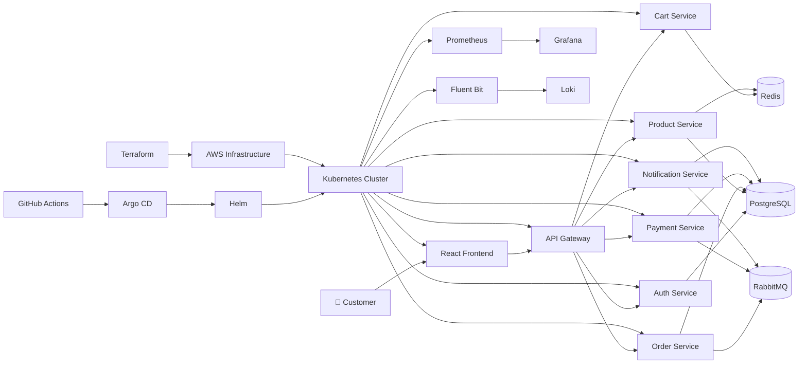

# 🚀 Production-Grade E-Commerce Microservices Platform on Kubernetes


---

# 🛒 Production-Grade E-Commerce Microservices Platform

A **Production-Grade Cloud-Native E-Commerce Platform** built using **Java 21**, **Spring Boot 3**, **React 19**, **Docker**, **Kubernetes**, **Helm**, **Terraform**, **AWS**, **GitHub Actions**, and **Argo CD**.

This project demonstrates how modern enterprise applications are designed, developed, deployed, monitored, secured, and operated in production environments.

Unlike traditional CRUD applications, this project follows enterprise software engineering practices including:

* Microservices Architecture
* Event-Driven Communication
* Database-per-Service Pattern
* GitOps Deployment
* Infrastructure as Code (IaC)
* CI/CD Automation
* Kubernetes Orchestration
* Cloud-Native Security
* Observability
* Production Hardening
* High Availability
* Disaster Recovery

The platform is designed to closely resemble the architecture used by large-scale technology companies and serves as a comprehensive reference for **Software Engineering**, **Backend Development**, **Cloud Engineering**, **Platform Engineering**, **DevOps**, and **Site Reliability Engineering (SRE)**.

---

# ✨ Key Features

| Feature                       | Description                                    |
| ----------------------------- | ---------------------------------------------- |
| 🏗 Microservices Architecture | Independently deployable Spring Boot services  |
| 🚪 API Gateway                | Centralized routing using Spring Cloud Gateway |
| 🔐 Authentication             | JWT Authentication with Refresh Tokens         |
| 🛍 Product Catalog            | Category, Inventory & Product Management       |
| 🛒 Shopping Cart              | Redis-backed Cart Service                      |
| 📦 Order Management           | Complete Order Lifecycle                       |
| 💳 Payment Processing         | Event-driven Payment Service                   |
| 📧 Notification Service       | Email/Event Notifications                      |
| 📨 RabbitMQ                   | Asynchronous Event Communication               |
| 🗄 PostgreSQL                 | Database-per-Service Pattern                   |
| ⚡ Redis                       | High-performance Caching                       |
| 🐳 Docker                     | Multi-stage Containerization                   |
| ☸ Kubernetes                  | Production-grade Orchestration                 |
| 📦 Helm                       | Kubernetes Package Management                  |
| 🔄 Argo CD                    | GitOps Continuous Deployment                   |
| ⚙ Terraform                   | AWS Infrastructure Provisioning                |
| 🚀 GitHub Actions             | Enterprise CI/CD Pipelines                     |
| 📈 Prometheus                 | Metrics Collection                             |
| 📊 Grafana                    | Real-Time Dashboards                           |
| 📜 Loki                       | Centralized Log Aggregation                    |
| 🛡 Trivy + Checkov + Gitleaks | Enterprise Security Scanning                   |
| 📋 OpenAPI                    | API Documentation                              |
| 🧪 Testcontainers             | Integration Testing                            |
| 📦 Flyway                     | Database Versioning                            |
| 📚 ADR Documentation          | Architecture Decision Records                  |
| 📈 Production Ready           | Enterprise-grade Deployment                    |

---

# 🏛 Enterprise Architecture



---

# 🏗 High-Level Architecture

```
                    Internet
                        │
                        ▼
              ┌────────────────────┐
              │ React Frontend     │
              │ (React 19 + Vite)  │
              └─────────┬──────────┘
                        │
                        ▼
              ┌────────────────────┐
              │ API Gateway        │
              │ Spring Cloud       │
              └─────────┬──────────┘
                        │
 ┌───────────┬──────────┼──────────┬───────────┬───────────┬───────────┐
 ▼           ▼          ▼          ▼           ▼           ▼
Auth      Product      Cart      Order      Payment   Notification
Service   Service     Service    Service    Service      Service

 │            │          │          │            │           │
 ▼            ▼          ▼          ▼            ▼           ▼

 PostgreSQL  PostgreSQL Redis   PostgreSQL PostgreSQL PostgreSQL

                 │
                 ▼

             RabbitMQ
         (Event Driven Messaging)

                 │
                 ▼

          Kubernetes Cluster
                 │
                 ▼

      Prometheus • Grafana • Loki

                 │
                 ▼

 Helm → Argo CD → AWS (Terraform)
```

---

# 🎯 Project Objectives

The primary goal of this project is to demonstrate how a real-world enterprise e-commerce platform can be designed using modern cloud-native technologies.

The platform emphasizes:

* Clean Architecture
* SOLID Principles
* Domain-Driven Design Concepts
* Scalable Microservices
* Event-Driven Architecture
* Containerization
* Infrastructure as Code
* GitOps
* CI/CD Automation
* Security Best Practices
* Observability
* High Availability
* Production Hardening
* Cloud Deployment on AWS

This repository is intended for learning, portfolio building, interview preparation, and as a reference implementation for enterprise software architecture.
